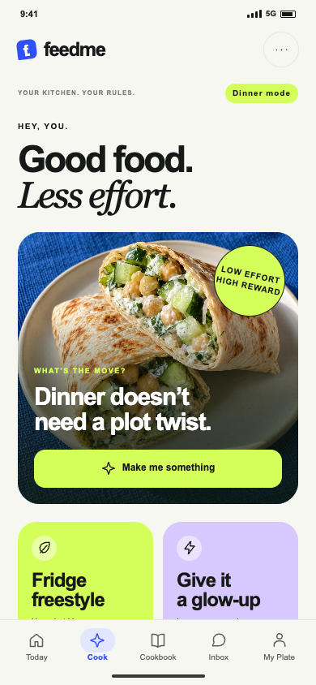
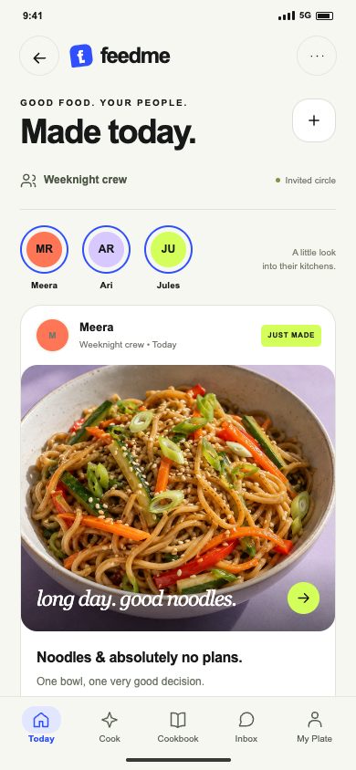
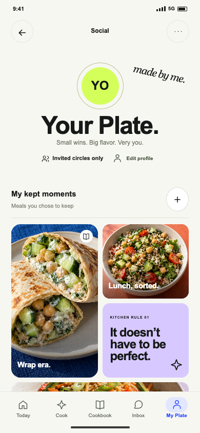

# FeedMe

### Your kitchen. Your rules.

Healthy cooking should fit the day you've had. FeedMe turns a friend's plate into a meal you can actually make—with your ingredients, your time and your energy.

**See a plate → Make Mine → cook your version → share if you feel like it.**

Android and iOS share Kotlin. The original cooking-and-social idea is intact: Make Mine, casual 24-hour **Today** posts, deliberately retained **My Plate** posts, and invited **Kitchen Circles**. This is not TasteEcho.

<p>
  
  
  
</p>

These are design-prototype screens, not proof that their services are implemented.

## Reference

Everything starts in the **[Reference library](Reference/README.md)**.

| Explore | Reference |
| --- | --- |
| Project idea and original identity | [FeedMe idea](Reference/PROJECT_IDEA.md) · [Product strategy](outputs/biteclub_blueprint/01_Product_Strategy.md) |
| All 54 feature plans | [Production blueprint](outputs/biteclub_blueprint/README.md) · [Feature implementation matrix](feedme/docs/FEATURE_DELIVERY_MATRIX.md) |
| All 98 UI screens | [Screen gallery](Reference/SCREEN_GALLERY.md) · [Interactive UI instructions](outputs/biteclub_ui/README.md) · [Design system](outputs/biteclub_ui/DESIGN_SYSTEM.md) |
| Screen maps and every button | [Mind map](outputs/biteclub_blueprint/maps/all_screens_mindmap.svg) · [Architecture map](outputs/biteclub_blueprint/maps/all_screens_architecture.svg) · [900-action ledger](outputs/biteclub_blueprint/registry/button_actions.csv) |
| Architecture and integration | [System architecture](outputs/biteclub_blueprint/architecture/02_Architecture.md) · [201-operation API contract](outputs/biteclub_blueprint/architecture/04_API_Contract.json) · [Integration guide](outputs/biteclub_blueprint/12_Integration_Guide.md) |
| Milestones and Shipaton preparation | [Release plan](feedme/docs/RELEASE_PLAN.md) · [Needs-user register](feedme/docs/USER_ACTIONS.md) |
| Source and tests | [Native app / shared Kotlin / local server](feedme/README.md) · [Implementation docs](feedme/docs/) |
| Built artifacts and history | [Current Android preview and historical demo](Reference/ARTIFACTS.md) · [Earlier BiteClub exports](Reference/History/README.md) |

## Current state — development, not shipped

The separately curated backend handoff under `server-deploy/` now contains the
current V001–V088 source closure and passes an offline JDK 17 server-distribution
build. It contains no credentials or runtime configuration and has not replaced
the historical closed Render preview; this is build-ready source, not a live API.

The blueprint covers **54 features, 98 screens, 900 canonical actions and 201 API operations**. Those numbers describe design/contract coverage, not completed native features.

The retained Android preview connects meal requests, pantry/preferences, guided cooking, foreground timers, cookbook storage, private text drafts and explicit reviewed publication. Accounts, recipes and the service are synthetic; publishing is self-only on the device. Real sign-in, photo upload, circles/live feeds, reviewed cooking content, billing, iOS verification and store release remain open. The earlier memory-only demo is preserved separately.

The 15 September source-workspace preview passes **360 JVM methods, 63 Android emulator methods, two clean lint reports and 76 individually reviewed captures**. These are bounded preview results, not completed product features or a native rerun of this public tree. Full scope remains 54 features, with 44 in V1 and the existing ten deferred. Read [the exact checkpoint and export limitations](Reference/SNAPSHOT_STATUS.md), [local-evidence boundary](Reference/LOCAL_EVIDENCE.md) and [build status](feedme/docs/BUILD_STATUS.md).

No app-store release, live backend, hosted UI or Devpost submission is implied by this public repository.

## Run locally

For the design prototype, open `outputs/biteclub_ui/index.html` after cloning, or serve the repository locally:

```sh
python3 -m http.server 8769 --bind 127.0.0.1
```

Then open [the UI gallery](http://127.0.0.1:8769/outputs/biteclub_ui/index.html?view=gallery) or [the blueprint explorer](http://127.0.0.1:8769/outputs/biteclub_blueprint/index.html). GitHub shows HTML source; it does not run these prototypes. No hosting is configured.

For Android, install JDK 17 and Android SDK 36, set `JAVA_HOME` and `ANDROID_HOME`, then:

```sh
cd feedme
./gradlew :shared:app:jvmTest :apps:android:testProgressUnitTest :apps:android:assembleProgress
```

For iOS, open `feedme/apps/ios/FeedMe.xcodeproj` in full Xcode. iOS has not yet been compiled on the development machine. See [setup and test prerequisites](Reference/SETUP.md).

## Repository layout

```text
Reference/                    Idea, screen index, status, preview, fixtures and history
feedme/                       Shared Kotlin, Android, iOS, local server, tests and docs
outputs/biteclub_blueprint/    Canonical feature plans, contracts, diagrams and screen specs
outputs/biteclub_ui/           Complete prototype, 98 PNG screens, assets and design tokens
tools/                        Export and reference-integrity helpers
```

The legacy `biteclub_*` folder names preserve working relative links. FeedMe is the active product name. Credentials, signing keys, local machine settings, dependency caches and unrelated projects are excluded. No open-source license has been selected; public visibility alone does not grant an additional license.
