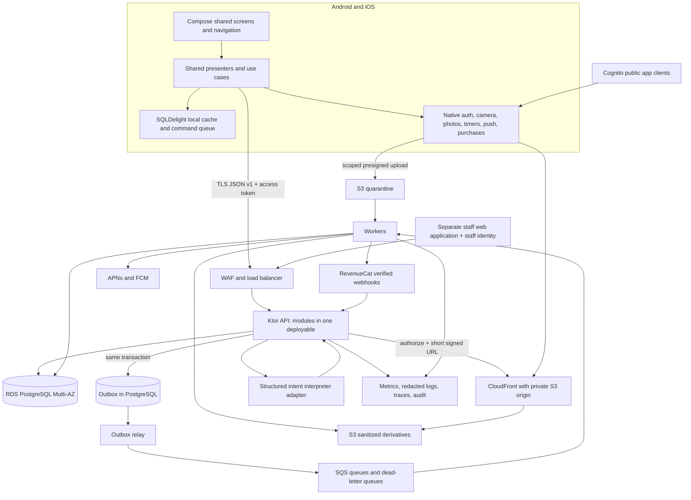

# FeedMe production architecture

Status: proposed build contract, 13 September 2026. Nothing in this document is deployed or load-tested. User-selected platform: Android and iOS with shared Kotlin. Read alongside [API](04_API_Contract.json), [data](03_Data_Model.md), [events](05_Events.md), [runbooks](09_Production_Runbooks.md), [security](10_Security_Privacy.md), and [decision evidence](11_Sources_Decisions.md).

## Outcome and constraints

FeedMe must complete a useful meal flow without a social graph, then let a permitted recipe become another person's achievable meal. Cooking state must survive an interrupted phone session. Privacy changes must take effect at the API immediately. Recommendations must remain constrained by reviewed recipe versions and explicit ingredient exclusions. Every social or paid action is authorized on the server.

Deploy one region initially with two availability zones, a stateless Kotlin Ktor API, a worker deployment from the same codebase, managed PostgreSQL, private object storage, and managed identity. Choose the region only after the launch country and provider-processing requirements are confirmed; Mumbai is a candidate for an India-first launch, not a settled residency claim. This document does not select an unverified legal launch market or age policy. Until that decision, implement configurable eligibility and invite-only adult pilot access.

## System diagram



The diagram shows deployment boundaries. The screen registry and navigation explorer enumerate every individual screen and route; screen families below define which module supplies them. No mobile client communicates directly with PostgreSQL, sends purchase entitlement writes, or receives a model/provider secret.

## Shared Kotlin structure

```text
:shared:core:models         immutable domain values, typed IDs, error codes
:shared:core:network        generated DTOs, Ktor client, auth injection, retry policy
:shared:core:database       SQLDelight schema, migrations, repositories, pending commands
:shared:core:design         tokens, accessible reusable UI components
:shared:core:navigation     sealed routes, link parser, route guards, restoration
:shared:feature:<module>    reducer/presenter, use cases, screens, repository ports
:shared:platform           interfaces for Auth/Media/Timer/Push/Purchase/SecureStore
:androidApp                Android implementations, WorkManager, manifest links
:iosApp                    Swift entry + platform implementations, entitlements, links
:server:<module>           HTTP adapter, application services, repositories, events
:server:app                dependency wiring, auth, transactions, migrations
:server:worker             jobs/outbox, media, notifications, reconciliation
:contracts                 API schema and event schemas; no server secrets
```

Compose Multiplatform is chosen for shared UI; native components handle system integrations and platform-specific accessibility gaps. Official Kotlin documentation supports shared business logic and optional shared UI; actual chosen compiler, Compose, Gradle, Xcode, Ktor and SQLDelight versions must be pinned together after a clean two-platform spike. Do not claim the newest individual versions are mutually compatible. [Kotlin Multiplatform](https://kotlinlang.org/multiplatform/)

Screen states use a sealed model: Initial, Loading(cached?), Content(data,freshness), Empty(nextAction), RecoverableError(previousData,retry), Forbidden, Gone. Requests never clear useful data just to show a spinner. Persist only identifiers and form drafts, not bearer URLs or authentication tokens in navigation restoration. A purchase, publish or destructive button becomes pending with its stable command ID; closing the app does not invent success.

## Server modules and screen ownership

| Module | Owns | Screen families | Synchronous imports allowed |
|---|---|---|---|
| identity | account bootstrap, guest sessions, registered sessions, merge/deletion orchestration | AUTH_*, SESSIONS, DELETE_ACCOUNT | platform, safety gate |
| profile | profile, private preferences, equipment, notification settings | PROFILE_SETUP, FOOD_PREFS, EQUIPMENT, SETTINGS, PRIVACY | identity public reader |
| pantry | ingredient presence, confirmed staples, reuse candidates | PANTRY, REUSE | catalog ingredient reader |
| catalog | reviewed immutable versions, ingredient taxonomy, substitution edges, packs' content | RECIPE, ADMIN_RECIPE/REVIEW/SUBSTITUTION | safety status reader |
| planning | requests, candidate filtering, Make Mine, alternatives, explanations | REQUEST, EFFORT, TASTE, RECOMMENDATIONS, ADAPT, VARIANT, TONIGHT | profile, pantry, catalog, memory and social recipe-access ports |
| cooking | step progress, timers, completion | COOK, TIMER, MEAL_DONE | planning plan reader, catalog recall reader |
| memory | feedback, explainable preference signals, private saves and collections | FEEDBACK, MEMORY*, COOKBOOK, COLLECTION* | cooking completion reader, catalog, social save-grant port |
| social | posts, attachments, remixes, reactions, visibility | TODAY, STORY, POST, PROFILE_PLATE, CAPTURE through PUBLISH_STATUS, REMIX_TRAIL | catalog, planning published-variant reader, circles membership, safety block reader |
| circles | circles, members, expiring invitations | CIRCLES, CIRCLE*, INVITE*, HOUSEHOLDS membership via port | identity/profile summaries, safety |
| conversations | pair/group threads, replies, recipe requests | INBOX, THREAD, RECIPE_REQUEST | social visibility, circles membership, safety |
| coordination | SOS, pacts, potlucks, contributions, shortcuts, polls | SOS_*, PACT_*, POTLUCK_*, CONTRIBUTION, SHORTCUT_*, POLL_* | catalog/planning recipe refs, circles, conversations |
| commerce | customer mappings, receipt reconciliation, entitlements, paid households | PACK_*, PAYWALL, PURCHASE_STATUS, MANAGE_PLAN, HOUSEHOLD_* | identity, circles membership |
| safety | blocks, mutes, reports, moderation cases, recall enforcement | BLOCKED, REPORT, DELETE_POST, ADMIN_REPORTS/CASE | no consumer writes; policy ports only |
| platform | uploads, push registration, flags, exports, audit, observability, support | NOTIFICATIONS, EXPORT, SUPPORT, ADMIN_FLAGS/AUDIT/INCIDENT, OFFLINE, UNAVAILABLE | explicit module export and admin ports |

Modules own their writes and tables. Foreign keys can reference shared IDs in the same database, but no feature reaches into another module's repositories. Cross-module reads use interfaces in a contracts package. A transaction coordinator may call two module services on one SQL connection for publish+attachment, save+grant, or guest merge. Async consumers receive events after commit. Architecture tests prohibit dependency cycles and unapproved table access. Redis can later cache public catalog reads or throttling counters; correctness never depends on it.

## New user identity sequence

1. AUTH_WELCOME offers signup, login, and bounded guest cooking. Signup/login opens the configured Cognito native SDK flow or browser managed-login flow. AUTH_SIGNUP/VERIFY/RESET/RESET_CONFIRM are native UI states mapped to Cognito operations, not proprietary password endpoints.
2. Browser OAuth uses a public client without a secret, authorization code + PKCE S256, state and nonce, allowlisted redirect, system browser, one outstanding verifier. AUTH_CALLBACK rejects unexpected issuer/state, exchanges once, stores refresh credentials in platform secure storage and clears the verifier. No embedded webview credential form. [Cognito client configuration](https://docs.aws.amazon.com/cognito/latest/developerguide/user-pool-settings-client-apps.html)
3. Native email/password screens call the provider SDK's supported sign-up/challenge/recovery APIs. Keep one auth adapter so tokens from both routes refresh according to their supported flow; test token rotation with remembered devices disabled initially. The API sees access tokens, never passwords or verification codes. [Cognito authentication](https://docs.aws.amazon.com/cognito/latest/developerguide/authentication-flows-public-server-side.html)
4. POST /v1/account/bootstrap creates/returns account by unique provider issuer+subject; response supplies profile status, eligibility/terms gates, entitlements, flags, and optional unconsumed invitation route. All app sessions carry a server device-session ID in addition to the access token so device revocation can be enforced before token expiry.
5. Guest session creation returns a narrowly scoped opaque token stored securely. Guest can browse published catalog, create bounded plans, cook and maintain private local data, never publish, message, purchase, join a circle or enumerate users. Proposed limit: 20 planning requests/day, 7-day server inactivity TTL, 30-day absolute TTL.
6. After authentication, offer Keep my cooking setup. POST guest merge requires both account access token and current guest token. In one locked transaction copy guest-owned plans/progress/feedback/saves using stable source IDs; merge pantry by latest confirmed timestamp, preserve registered hard exclusions and union explicit guest exclusions, mark conflicts for review, do not silently overwrite registered profile. Mark guest transferred once and invalidate guest token. Retry returns the same merge result.
7. PROFILE_SETUP → FOOD_PREFS → EQUIPMENT → optional notification permission → HOME. Skipping optional preferences records unknown, not an empty set of exclusions. Deep links resume only after fresh authorization and required gates.

## Make Mine and all planning modes in production

All entry points construct one PlanRequest: sourceRecipeVersionId or sourcePostId/savedRecipeId, mode(COOK/ASSEMBLE/IMPROVE), ingredient confirmations, maxActiveMinutes/maxTotalMinutes, energy, available equipment, servings, taste tags and household scope if authorized. F01, F02, F05–F10, F20 and F33 reuse this contract.

1. Resolve source visibility and permitted recipe version. A food photo alone cannot create a reviewed recipe: return RECIPE_DETAILS_REQUIRED with Ask for recipe. Creator-confirmed but unreviewed attachments are labelled personal recipe and cannot become a claim of reviewed safety or receive automatic unsupported transformations.
2. Snapshot confirmed constraints and preference version. If natural language was supplied, an interpreter produces typed ingredient candidates and constraint candidates with confidence. Known explicit exclusions from profile always dominate. Unknown ingredient names require confirmation. Prompt text never selects tools, SQL, arbitrary URLs or catalog policy.
3. Deterministically filter published, non-recalled versions for hard exclusions, equipment, supported mode, ingredient dependencies and required cooking operations. Apply approved substitution edges only where their recipe applicability and review status match. Never delete a required heat step to satisfy an energy request.
4. Rank feasible candidates by ingredient coverage, requested time/effort, taste and editable memories. Initial weights are proposed, versioned configuration: feasibility first; then 0.35 fit, 0.25 effort, 0.20 availability, 0.15 repeat preference, 0.05 controlled variety. Those scores are internal and are not nutritional quality scores. Ties use stable recipe ID plus request seed so retries match.
5. Persist immutable plan version, recipe-version links, actual ingredients/steps/timings, constraint snapshot, substitution proof IDs and explanation reason codes. User sees changes, missing ingredients, active/total time and utensils. Adapt/simplify/alternative creates a child plan, never mutates the currently cooking version. A client request cannot increase serving count beyond the reviewed scaling range.
6. If no candidate meets all hard constraints, return NO_COMPATIBLE_RECIPE and specific user-editable soft constraints (time/equipment/available ingredients). The app offers manual edits or a different request; no silent exclusion relaxation. If model provider fails, structured controls and deterministic catalog search remain usable.
7. Before starting or sharing, recheck current recall and permissions. Catalog recall overrides cached recommendation status. Offline cached cooking can continue with the last known reviewed version and a visible last-sync indicator; offline content cannot promise awareness of later recalls.

## Cooking and personal data synchronization

Start creates a cook session pinned to one plan version. Each local step transition has commandId, sessionId, baseVersion and device sequence. Local SQL transaction updates the step and enqueues its command. API accepts owner-only If-Match updates, returning the new ETag. On 412, fetch the session and let the user choose Resume this device or Use other device when concurrent progress differs; do not let an old retry reset a completed session. Completion is terminal and unique per session; feedback can be edited separately.

Timers persist endAt, duration and pausedRemainingSeconds; they are not decremented as persistent writes each second. Native notifications provide best-effort alerts subject to device permissions and OS scheduling. The current timer screen recomputes remaining time from a monotonic clock while foregrounded and reconciles wall-clock changes. Neither iOS background execution nor Android WorkManager should be described as an exact timer delivery guarantee. [Android background work](https://developer.android.com/develop/background-work/background-tasks/persistent), [Apple Background Tasks](https://developer.apple.com/documentation/backgroundtasks)

Memory updates are reversible derived records, retain signal source and reason, and cannot infer a medical condition. Deleting a feedback item rebuilds affected preference aggregates. Make Again creates a private saved recipe/plan snapshot; social save grants are distinct and validated at copy time.

## Publishing, stories, media and privacy

1. Composer draft starts locally; explicit Save draft uses owner-bound `/v1/post-drafts` and stable clientDraftId for cross-device resumption. Prepare upload reserves random object key and a short presigned POST with byte-size/content/checksum restrictions. Owner uploads to quarantine. CompleteUpload verifies owned upload, checksum, expected object version and metadata; API marks processing and sends a job. A presigned URL can be reused until it expires, so workers read the verified object version and never a mutable key alone. [S3 presigned URLs](https://docs.aws.amazon.com/AmazonS3/latest/userguide/using-presigned-url.html)
2. Worker independently sniffs type, validates size/dimensions/duration, strips EXIF/location, malware scans, moderates content, re-encodes derivatives and marks READY or REJECTED. Original quarantine object is never a CDN origin. Images max 10 MB input; later clips max 30 seconds and 50 MB are proposed launch caps, configurable and disclosed before upload.
3. Publish validates ready owned media, current audience membership, save-grant disclosure, terms acceptance, attachment version, source remix access, and idempotency. Commit post, media association, audience, attachment snapshot, lineage and outbox together. No partial visible post. Since media validation is async, publish before ready returns MEDIA_NOT_READY with retry-after/poll status.
4. Today visibility is `status=published AND expires_at > database_now()` for every feed/detail/access read. expires_at = published_at + 24 hours; keep_on_plate controls a separate projection. Scheduled expiry only removes stale projections/notifications; it is not the security boundary. A persisted plate item can remain accessible through My Plate even after Today expires. A Today-only item becomes unavailable to non-authors after expiry.
5. API authorizes each media access against post status, surface, audience, blocks, circle membership and current ACL version before issuing a CloudFront URL. TTL = min(60 seconds, remaining Today lifetime when Today-only, remaining grant lifetime). Private bucket restricts origin access to CloudFront OAC. CDN URL is a temporary bearer capability; already issued URLs can remain usable to their holder for their residual TTL and a started transfer can finish. State this limitation accurately. [CloudFront signed delivery](https://docs.aws.amazon.com/AmazonCloudFront/latest/DeveloperGuide/private-content-signed-urls.html), [private S3 origin](https://docs.aws.amazon.com/AmazonCloudFront/latest/DeveloperGuide/private-content-restricting-access-to-s3.html)
6. Audience narrowing/block/deletion denies new API access immediately and queues invalidation/deletion as appropriate; urgent legal removal additionally removes origin derivatives and invalidates CDN. Signed URLs are redacted from logs. Authenticated private JSON has no shared CDN caching. Mobile media cache stays account-scoped, clears on logout, and honors expiry. Screenshots/downloads outside the app cannot be revoked.
7. A recipe-save permission authorizes a private immutable recipe copy only. Revoking permission stops new copies. Existing authorized copies persist independently unless recalled for safety/legal reasons; media, replies and original post audience never travel with it. Account deletion removes creator identity as required. A remix publishes the cook's own media and confirmed changes; hidden ancestors appear only as Unavailable inspiration, with no identifying metadata.

## Social graph and coordination integration

Launch uses invited circles and no public discovery requirement. Feed pagination is keyset(created_at,id) and current membership filtering. Post audience bindings store the author's membership generation: leaving and rejoining does not reactivate that author's old grant; historical rebinding requires an explicit authorized update. At the pilot ceiling, fan-out-on-read is simpler than maintaining a feed row per follower; add an audience-indexed projection only after measured query cost warrants it. Mutes affect presentation and push, blocks affect both directions' interaction/access. Push fan-out rechecks membership and blocks at send time.

Replies are threads with explicit participant membership; a post's audience does not automatically gain access to a private reply. Ask for recipe is a typed thread message with a post reference; if the post becomes private, the message retains the request but hides inaccessible post details. The server enforces message length/rate and sends push hints containing object ID only. Clients pull authorized content after notification tap.

SOS reuses PlanRequest constraints but shares only fields the author chooses. Dinner Pact stores one invitation and per-member plan IDs; a participant's private constraints are never returned to others. Bring a Bit stores volunteered contribution quantities with optimistic locking and claims using a unique contribution owner row, preventing double claims. Poll options are immutable supported meal references after the first vote; replace a vote transactionally and use server closing time. Shortcut suggestions are UGC until a reviewer publishes an approved catalog instruction; shortcut popularity never modifies a reviewed cooking step automatically.

## Purchases and households

StoreKit/Google Play purchase UI is accessed through native adapters, optionally RevenueCat SDK adapters. Require account identity before purchasing; configure opaque FeedMe UUID as the provider app user ID. Server maps products to entitlements (library_tools, household_plan, situation_pack:<id>) and ignores client-supplied access flags. The base private recipe library remains accessible on expiry.

Webhook ingress authenticates configured secret header and HMAC over raw bytes when enabled, records unique provider event ID durably and responds quickly; processing happens after durable receipt. Reconcile authoritative subscriber state through the provider API rather than applying events as an assumed chronological delta. Event retries are normal. Handle cancellation, expiration, refund/revocation, billing issue, transfer, restore and sandbox isolation. [RevenueCat webhooks](https://www.revenuecat.com/docs/integrations/webhooks)

Purchase status can be Pending verification even if native UI reports success. The client calls reconcile and polls a bounded job; only server entitlements unlock server tools. During provider failure, existing previously verified access may use a proposed 24-hour grace only when prior paid expiry has not established a known refund/revocation. New access remains pending. Restore never merges two FeedMe accounts automatically. Household benefits cover explicit accepted memberships (proposed owner + 5 members), not an unverified store Family Sharing claim. Membership and entitlement checks happen on every household operation; personal saved recipes are retained when leaving.

## Final integration rules

Pantry distinguishes confirmed availability, usual staples and uncertainty; confirmedAt may be null and quantities are optional. PlanRequest supports auto mode, while an improve request includes explicit baseMeal context. Stored plans use a resolved supported mode. Simplification specifies lessPrep/lessCleanup/lessTime/overall and whether a different meal is acceptable; alternative cursors are owner+constraint-bound with a proposed ten-minute expiry and bounded exclusion history. Timing distinguishes active, waiting and cleanup estimates and labels reviewer estimates, actual pilot observations or creator-reported personal content honestly.

Feedback can target an owned cook/plan, a catalog recipe, an ingredient, or an explicit sensory/preparation tag; it never fabricates a completed cook. SaveRecipe and SavePostRecipe accept markMakeAgain so neutral Save and repeat preference remain distinct. Editable memory returns its context as well as provenance. Collection reorder changes organization only. Household selected participants and opaque consent revision bind a joint planning request; the API returns only the actor's preference fields and neutral group compatibility, never another person's exclusions. Owner-managed equipment/default servings are a separate shared-kitchen resource.

Author attachment edits after a recipe request validate current rights and post ETag, create a new version-bound save policy, and retain already granted old recipe copies subject to recall. Future default audiences/contact choices do not rewrite existing grants. Public discovery remains disabled; hiding social UI does not bypass any server policy. Exact operations, named request schemas and representative request examples are in the OpenAPI contract.

## Delivery, dependency injection and test seams

Use interfaces AuthPort, CatalogReadPort, AudiencePolicy, ObjectStore, EntitlementReader, Clock, IntentInterpreter and EventPublisher; production and deterministic fake adapters share contract tests. Generated DTOs are mapped to stable domain models so additive transport changes do not ripple through screens. Feature modules expose routes and one facade, not database entities. API schema CI validates operation IDs, examples and backward compatibility. Consumer contracts cover app N and N−1 server compatibility.

One server release runs additive migrations before enabling a feature flag. Expand → dual read/write where needed → backfill → switch reads → remove old field only after oldest supported app no longer depends on it. Deploy API canary separately from worker consumer versions. Kill switches disable mutation entry points server-side, not just buttons; safe read access and ongoing cooking continue. Observability separates authorized denials, client validation failures, provider failures and server faults.

## Architecture acceptance gates

The first platform spike must prove login/refresh/logout on two physical OS devices, guest merge retry, offline cooking resume, one photo through quarantine and authorization, one circle post → Make Mine → Your Take, a privacy-revocation race test, and a sandbox purchase → webhook reconciliation. Then measure accessibility, startup, thermal/media memory, and provider costs. No unproven production latency or privacy guarantees should appear in marketing. Detailed proposed SLOs and drills are in the runbooks.
